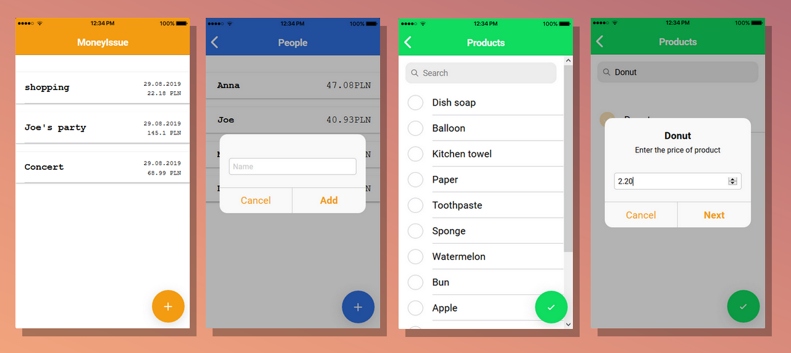
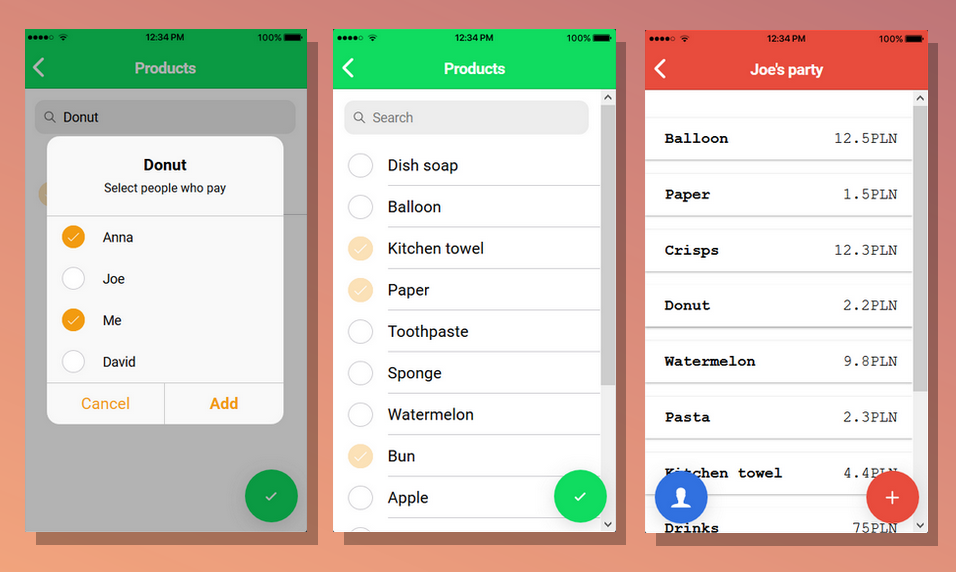
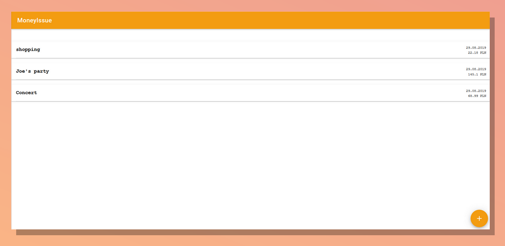

<p align="center">
	:money_with_wings: :money_with_wings: :money_with_wings:
</p>
<h1 align="center">
	Money Issue
</h1>

> Cross-platform application which can be used to create a list of whip-rounds with people who owe money for daily products.

## Table of contents
* [Introduction](#introduction)
* [Features](#features)
* [Technologies](#technologies)
* [Demo](#demo)
* [Screenshots](#screenshots)
* [Setup](#setup)
* [License](#license)

## Introduction
**Money Issue** is an multiplatform application that allows create **list of whip-rounds with people who owe money**.
</br></br>
You can write down **products** & **prices** to have a **list of people who owes money and how much**.
</br></br>
**Whip-rounds** in the meaning situations when **group of people pay** for some products or other things, like for example: *shopping list, visits outside home in restaurants or pubs, for a taxi etc*.
</br></br>
**The great convenience** is that you can **choose who paid for each product** because not everyone had to pay for everything.
</br></br>
Design is **neat and minimalistic** which make it **user friendly**.
</br></br>
An application can be used **in the browser** or on **smartphone** with **Android or IOS** system and was tested on *Mozilla Firefox 69.0.1*.
</br></br>
Created in **Typescript** using **Ionic** with **Angular** framework & **Firebase** platform for storing database.

*Project was made for passing the subject in college.*

## Features
The main purpose is **creating a list of products, people who owes money and how much**. 
* Create unlimited whip-rounds
* Add people who owes money
* Add products or things that were paid for
* Choose who paid for each product
* Information who owes how much money
* Everything store in cloud database
* Minimalistic, user friendly design

## Technologies
* Node.js 10.15.3
* Typescript 3.1.6
* Ionic CLI 4.12.0
* Ionic Framework 4.4.2
* Angular 7.2.2, angularfire2 5.2.1
* Firebase 6.1.0, Cloud Firestore
* tslint 5.16.0

## Demo
[Live Demo](https://moneyissue-2e684.firebaseapp.com/home)

## Screenshots
<p align="center">
	
	
	
</p>

## Setup
* [Install Node.js](https://nodejs.org/en/download/)
* Clone repository
```
git clone https://github.com/mroui/money-issue.git
```
* Enter the main folder `money-issue`
* Update npm, just in case (Node Package Manager, it comes with node.js installation)
```
npm install -g npm
```
* Install Ionic Cli
```
npm install -g ionic
```
* Install NPM Dependencies
```
npm install
```
* Create Firebase project and add the project configurations to the ./src/environments/environment.ts file -> 
[Instruction](https://ionicthemes.com/tutorials/about/setting-up-a-database-for-an-ionic-app-with-firebase)
* Launch App
```
# Web overview
ionic serve

#Android & IOS overview
ionic serve --lab
```

## License
This project is licensed under the terms of the MIT license.
